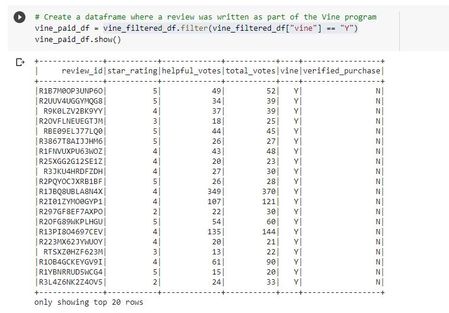
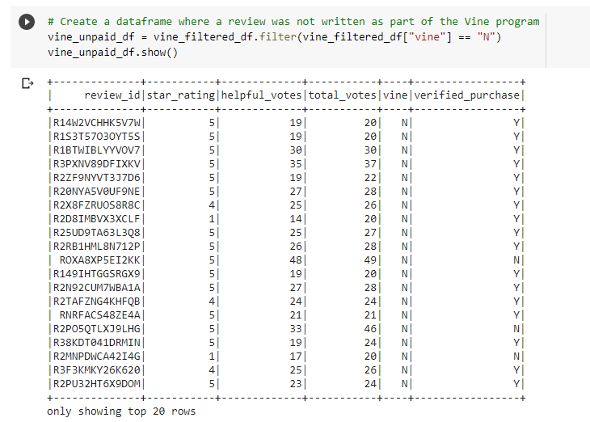
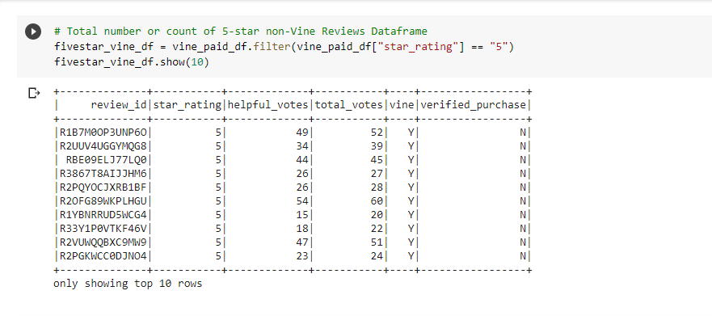
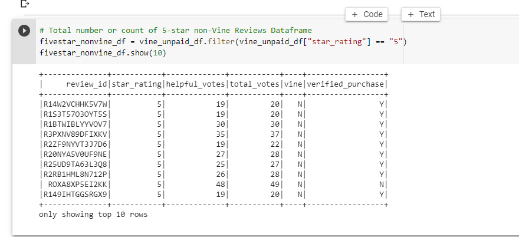
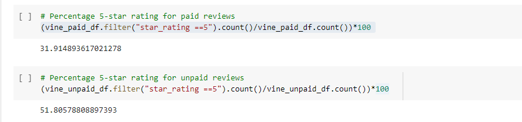

# Amazon_Vine_Analysis
To use Pyspark to analyze Amazon reviews written by members of the paid Amazon Vine program

## Overview of the Amazon Vine Analysis
The purpose of this work / challenge is to use Pyspark to analyze and review data (from watches) written by members of the paid Amazon Vine program and those from the non-vine program. Specifically, this analysis involved;

1. The use of Pyspark perform an ETL process to extract the dataset relating to watch reviews, transform the data, connect to an AWS RDS instance, and load the transformed data into pgAdmin. 

2. Using Pyspark to also determine if there is any bias toward favorable reviews from Vine members in the watches reviews dataset 

3. Generating a summary report analysis for the SellBy stakeholders (SellBy pays a small fee to Amazon and provide products to Amazon Vine members, who are then required to publish a review)

To generate this analysis, I utilized the following resources;

Data Source: https://s3.amazonaws.com/amazon-reviews-pds/tsv/amazon_reviews_us_Watches_v1_00.tsv.gz

Softwares: Google Colab Notebook, Pyspark, PgAdmin, PostgreSQL, AWS

## Results
The following are important outcomes generated from the Amazon Vine Analysis;

1. **How many Vine reviews and non-Vine reviews were there?** From the results of the review (as per deliverable 2), the total number of Vine reviews were 47 while that of non-Vine reviews were 8,362. The 2 images below show a snapshot of the dataframes of the 2 categories (Vine & non-Vine reviews)

2. **How many Vine reviews were 5 stars? How many non-Vine reviews were 5 stars?** From the results generated in deliverable 2, of the 47 Vine reviews, 15 were 5-stars while 4,332 of the 8,362 non-Vine reviews were 5-stars. The 2 images below show a snapshot of the dataframes of the 2 categories (Vine & non-Vine reviews)

3. **What percentage of Vine reviews were 5 stars? What percentage of non-Vine reviews were 5 stars?** 31.91% of the vine reviews were 5-stars while 51.81% of the non-vine reviews were 5-stars. The image below shows a snapshot of the code used to derive these percentages

## Summary
In summary and following the review of the results generated in deliverable 2, there is no evidence of positivity bias for reviews from the paid vine program. This is because the result above shows that only 31.91% of the total vine reviews were rated 5-stars compared to 51.81% from the non-vine reviews.  A suspicion of positivity bias for reviews from the vine program would have generated the opposite the above results where the percentage of 5-star ratings from the vine reviews will be significantly higher than those from the non-vine reviews.

In addition, one analysis that I would have generated from the dataset to support my conclusion of non-bias from the vine program will be to generate an analysis/ report from the dataset that compares products (watches) rated as 5-stars from the vine reviews to those products (watches) rated as 5-stars from the non-vine reviews. I expect this analysis to reveal a significant number of common products from both vine and non-vine reviews with 5 star ratings. Another analysis will be to generate a verified volume purchase report of watches (product ID) rated 5-star by members of the vine program. It is expected that a significant number of the 5 star rated watches would be among the most purchased.   
